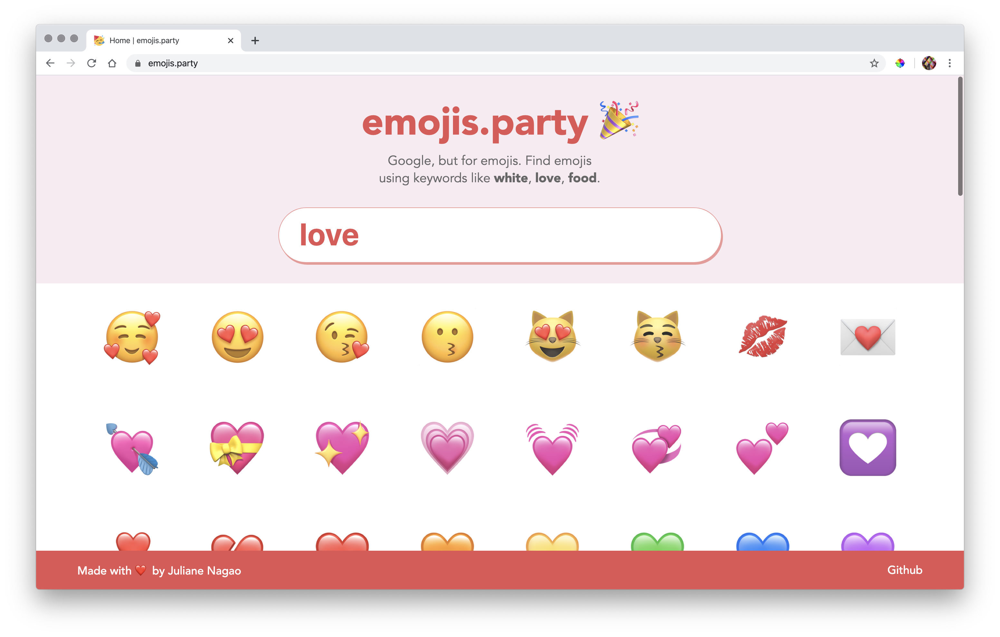

# emojis.party

Google for emojis. Find related emojis instantly using keywords like `white`, `love`, `food`, `animals`, `hello`, etc.

## 👀 Preview

http://emojis.party/



# 🚀 Quick start

1. Download the project and cd into it:

```
git clone https://github.com/junagao/emojis.party.git
cd emojis.party
```

2. Install dependencies and run the application:

```
yarn install
gatsby develop
```

3. Open your browser and navigate:

http://localhost:8000

## 🧐 What's inside?

- Search emojis by:
  - Category names - `animals`, `food`, `body`, `flags`, etc.
  - Colors - `red`, `blue`, `yellow`, `white`, `black`, etc.
  - Unicode codepoints - `1F44C` or `U+1F44C`
  - Shortcodes - `:raised_hands:`, `:+1:`
  - Emoji names or other related keywords - `love`, `beach`, `family`, `sun`, etc.

## 📚 Tech Stack

- React
- React Hooks
- Gatsby
- Babel
- Styled Components
- Prettier

## Author

Juliane Nagao - [GitHub](https://github.com/junagao) - [LinkedIn](https://www.linkedin.com/in/junagao/)

## License

This project is licensed under the MIT License.
